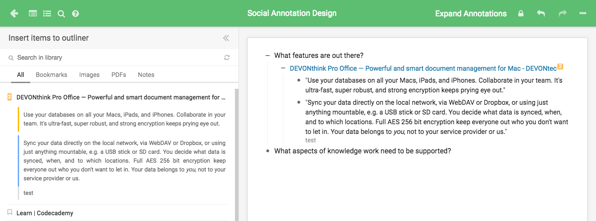

Thoughts on Discow Design v0.1
====================================

On the H side of Discow, we are not only looking at how annotations can support student learning. We are fundamentally concerned with *how knowledge workers deal with information or knowledge*. This is a living document of the design of Discow on this front. Below, we capture key design ideas. At the bottom of this page, we are surveying available systems for (creative) knowledge work, as there is a long list of knowledge management software in this space.

## Facets of the Design

> “An idea is not a single thing. It is more like a swarm.”
> -- Steven Johnson, Where Good Ideas Come From

- [Pull](https://hbr.org/2009/04/four-ways-to-use-serendipity-t.html), serendipity, and "structured spikes" (JS Brown)
- Creative cities (Richard Florida)

**Idea Magnets (IMA)**

- Larger knowledge structures: which give annotations a purpose. It is akin to answers to questions like "what this idea is promising for" in my earlier studies.
- Cross-boundary objects: such magnets could serve as boundary objects between KF and H. In KF, students may spend significant amount of time to come up with their Idea Magnets---higher level knowledge, wonderments, juicy ideas, inquiry topics, etc. These Idea Magnets are then rendered in H to support *pulling* of promising ideas, promising pieces of information, interesting or surprising information to form a *swarm* around the Idea Magnets. The forming swarms are rendered in KF, with connections drawn among them based on shared annotations and highlights. For example, two Magnets are linked if they share one annotated ideas.

Questions:
- magnets vs tags: magnets are emerging, high-level knowledge structures that are tied to student interests. Tags are describers of annotations, which can be about anything.
- What does the Pull action really mean? NEED TO THINK/DISCUSS MORE.

### Annotate

Basic annotation process supported by H.

### Organize annotations to make them useful for knowledge work

- **Tags**: supported by current H. Metadata to make annotations more discoverable.
- **Epistemic markers** in an annotation: help students think about the annotated text.
- **Idea Magnets (IMAs)**: larger knowledge structures the annotation is made for. An *IMA* attracts or pulls annotations. I wish to help students think about an idea as a swarm, so annotations they make get attracted to larger ideas or knowledge structures. They can pretty much drag and drop annotations to magnets, which can be visualized as a group or as a list (in an Outliner). (Before coming up with the name Idea Magnets, I thought about names like Outlines and "Big ideas". Too boring.)

### Review and next-step actions

What's largely missing in existing annotation tools is the lack of support for further work empowered by annotations. Diigo is making progress recently in this regard. It used to be a personal library you keep dumping links and annotations into. Right now it adds an **Outliner** that you can use to organize your notes and share via a URL to someone else. DevonThink allows you to filter and port notes to a "Smart Group." This is also interesting.

But we may need stronger support for further actions taken on annotations. The Promising Ideas tool makes sense. But we needs better design. This part is something we need to think deeper in the Discow project.

- Where should review and reflection take place? In H or KF?
- How to support search and filtering?
- How knowledge gets moved across spaces while maintaining its original context? (We are essentially moving knowledge from a webpage, to H, and potentially to KF or other tools.)

----

After posing these questions earlier, I dwelled on the notion of Idea Magnets a bit. Here are my thoughts now:

- Where should review and reflection take place? In H or KF? --> In KF, where Idea Magnets are rendered.
- How to support search and filtering? --> need to tease out types of knowledge objects in the system -- KF notes, highlights, annotations, replies to annotations, magnets, tags, epistemic markers, etc. Those could be all used for filtering.
- How knowledge gets moved across spaces while maintaining its original context? --> KF generates IMAs --> rendered in H; Web content --> captured by H --> attached to IMAs --> rendered in KF for reflection.

## Related Projects

### Promising Ideas tool

Bodong programmed the tool in Knowledge Forum 4 and it's now implemented in KF6 as well. (It needs a refresh.)

### DevonThink (Mac)

- Databases: containing files; independent from each other
- Duplicate vs. Replicate: duplicates are independent; replicates are linked with each other
- Tags
  - Group tags and ordinary tags: [video](https://www.youtube.com/watch?v=di3MlFLMOf4). DevonThink provides interesting ways to add tags, change tags, and make use of tags. The idea of filtering docs by tags and addign to a `smart group` is quite interesting and may apply to Discow very well.
- Labels
- Inbox: collecting information into DevonThink (global for all databases); can also be specific to databases
- Highlight notes

### Diigo

- Stripping away social features; keeping personal library and teams
- Outliner: [video](https://www.youtube.com/watch?v=-8yoSzn6Fp8)
  - quite interesting: basically another way to organize knowledge (in addition to tags)
  - drag and drop: 1) links; 2) highlights; to an outline

### [Highlights App](http://highlightsapp.net/) (Mac)

- Export directly to a range of applications

### Swarm Intelligence

- http://unu.ai/
