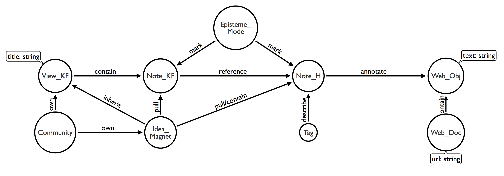

Idea Magnets Design: Version 2
===========================

This design document builds upon:

- [Design version 1](design-v1.md)
- [Design workshop #1](../workshops/design-workshop-1.md)

## Continue to Elaborate Idea Magnets

As we continue to engage stakeholders in the design conversations, our thinking on Idea Magnets is constantly evolving. Below are some notes about our current understanding of Idea Magnets and other related items.

The design is grounded in thinking on Knowledge Building and its technology (so there are probably hidden assumptions) and informed by broader considerations of means to promote knowledge creation (e.g., in CSCW).

### What is an Idea Magnet?

- A problem space that gives inquiry a purpose.
- A knowledge structure that pulls together multiple sources of ideas (from different spaces or/and people).
- Technically, a cross-boundary object that connect knowledge-building work across contexts.
- Metaphorically, it provides a 'pulling force' that attracts conceptual objects together to form a bigger structure leading towards more advanced understanding. It provides a pull mechanism (an enabling factor), but the intentional pulling action is expected to be done by epistemic agents (even though we have not ruled out the possibility of algorithmic pulling yet).

For the end-user (teachers, students, knowledge workers), **an Idea Magnet can be explained as a problem space that one is concerned with, that is currently ill-defined, that will benefit from a richer and more diverse set of ideas, and that will benefit from intentional actions to bring order to diverse ideas.**

### Where does an Idea Magnet reside in one's creative workflow?

Ideally, it has a pervasive and ambient presence since its goal is to continually gather, organize, connect, and build ideas. The user can access it anywhere (in the dedicated KB environment, anywhere on the web, on a mobile device).

Technically, it is hosted by the dedicated KB environment (Knowledge Forum) and made accessible by other entry-points like a browser plugin and a mobile app.

### What other conceptual artifacts are related to Idea Magnets? How do they work together?

There are a few types of conceptual artifacts we consider. They include: a note (in KF), a web document, a text snippet tagged in a web document, an annotation made by a user about a text snippet, other media objects (a picture, a JS visualization, a video), and an idea magnet.

First, we are working to reconcile the conceptual space involving these many objects. One way to think about the space is to ask Who/Whose, What, When & Where questions about each type of these objects. For example, a KF note can be made by a student about a preliminary idea she had when the class started to talk about genetic engineering. An annotation can also be made by the student, containing her idea about an expert's idea explained to a general audience on a website (e.g. Science Today America) at a time of a genetic engineering scandal. Since the goal is to empower knowledge workers to develop their ideas, the design needs to pivot on their ideas---in KF notes and annotations---as well as connections formed to advance these ideas.

A decision: Refer to Hypothesis annotations as notes as well.

Based on this evolving understanding, below is a revised 'graph model' that illustrates the relations among key conceptual objects in this design.

- `Community`: A KB community hosted on KF. For each KF community, a private group will be created on Hypothesis/IdeaMagnets. SSO will be used for authentication.
- `View_KF`: A KF view.
- `Idea_Magnet`: An idea magnet. It 'inherits' / is a subclass of View_KF. This will help us reuse implemented features of KF_View. On KF, an idea magnet is shown as a special kind of view.
- `Note_KF`: A KF note containing ideas.
- `Note_H`: A Hypothesis/IdeaMagnets annotation. Here we refer it as `note` to show its equivalence to a KF note because it captures students' own ideas but in a different space.
- `Episteme_Mode`: A generic set of KF scaffolds that are consistently shown in both KF and Hypothesis/IdeaMagnets. They mark the Epistemic Mode of a particular note contribution (Note_KF or Note_H).
- `Web_Obj`: A web object annotated by Note_H. Right now it can only be text. But it can be expanded to other modalities in the future.
- `Web_Doc`: A web document containing the annotated web object.
- `Tag`: A Hypothesis/IdeaMagnets tag describing a Note_H. (In the future, consider integrating with keywords in KF.)

### When and How is an Idea Magnet created?

Any one in the community could create an idea magnet at any time. Created magnets below to the community.

A magnet can be created in the beginning of an inquiry to define a problem space for the class. A magnet can be also created in the middle of an inquiry when a new problem emerges or when it becomes desirable to dissect an earlier problem into multiple ones.

The community will spend time to review and manage their magnets (meta-discourse). There should be an option of merging several idea magnets into one. This is useful for them to 'merge' related efforts in the community.

### How does an Idea Magnet function in KF and H?

In KF, an idea magnet functions like a view, but in a special manner (see the interface design below). It serves as a container for Note_H.

In Hypothesis/IdeaMagnets, an idea magnet (defined in KF) is available for a user to choose from when creating a Note_H.

### How does an Idea Magnet look like on the interface?

The interface design on Hypothesis/IdeaMagnets needs some further refinement but is quite mature.

The interface design on KF is the current focus. [Here](https://balsamiq.cloud/stmze/poad6) are some sketches to be discussed. Comments are welcomed.

## Plans for Design Workshop #2

- To engage us in thinking about the workflow involving idea magnets
- To think about KF design details

## Design Inspirations

The design above was inspired by some of the projects listed below.

- Florida Hospital's Innovation Lab, (FHIL)
- [Viima](https://app.viima.com/clig/)
- [Idea Note](https://app.ideanote.io/)
- [Aha!](https://www.aha.io/)
- [Milanote](https://www.milanote.com/). Milanote is **very** well designed. So intuitive to use.
- [Best Idea Management Software | 2017 Reviews of the Most Popular Systems](https://www.capterra.com/idea-management-software/?utf8=%E2%9C%93&users=&sort_options=Most+Reviews). This is a list of "idea management" tools that I found very interesting.
- Mixing ideas [@Guha2004-zf]
