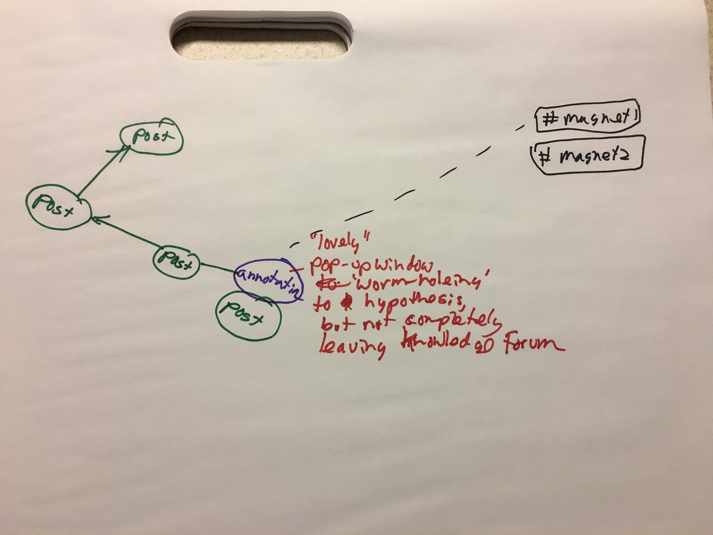
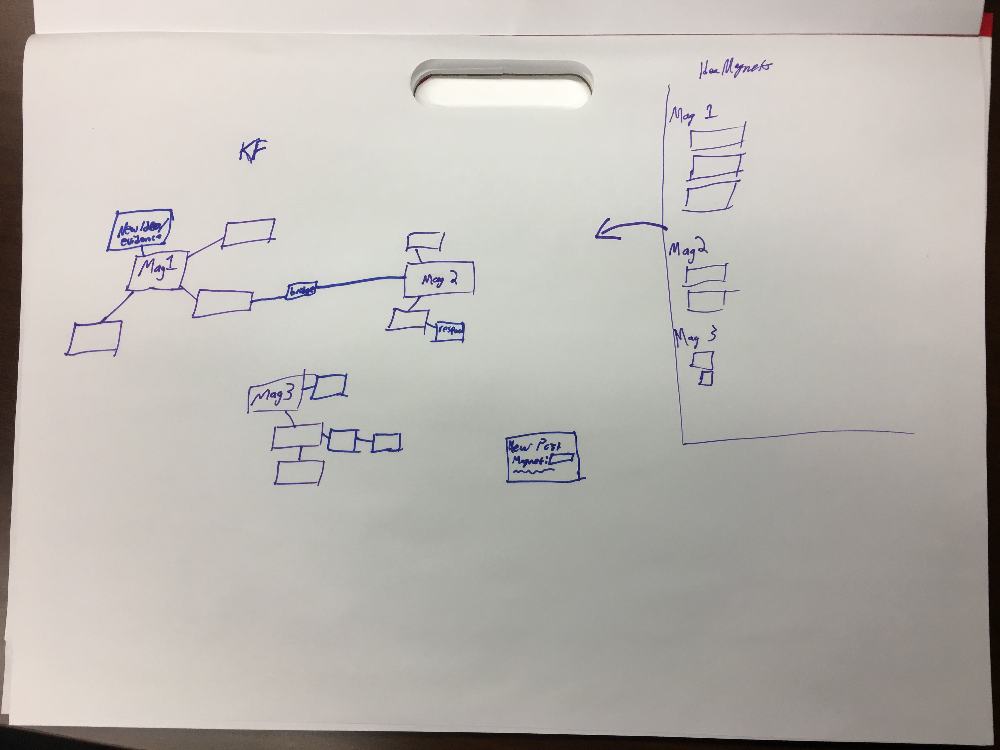
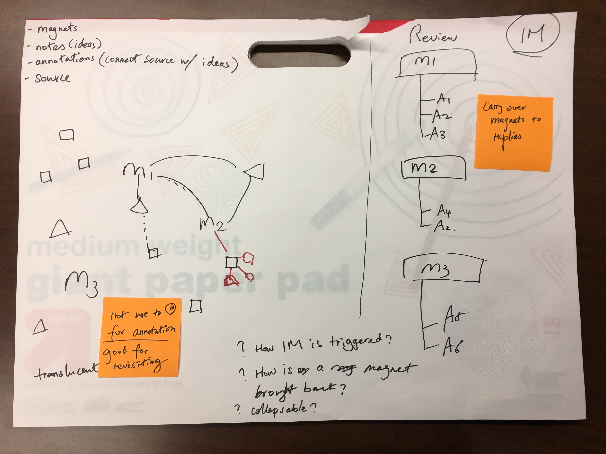

Design Workshop 1
=================

## Participatory Design with Teachers

Date: 10/11/2017  
Location: South High School  
Workshop agenda: [Google doc](https://docs.google.com/document/d/1DF1khNcBEfRprMEHazKjMcsV-Be_9nan9N4LtciNJ48/edit)

Summary: The first participatory design workshop took place in a classroom at South High, with participation from three teachers and three project members. We introduced the current design of IdeaMagnets to teachers and solicited their design ideas. We provided sketch pads and two teachers (J and R) sketched their design ideas. We also got a chance to learn about Teacher D's current work with his students on "Indoor Farming." The conversation was audio-recorded.

Two major design ideas were captured from the conversation.

### 1. Use magnets to organize the discourse space in Knowledge Forum (Teacher J)

(Sometimes magnets were mentioned as hashtags by the teacher)

Basically, the magnets will be present somewhere on the Knowledge Forum interface. By clicking on a magnet, the user can filter notes and annotations based on their attachment to the magnet.

This design idea is akin to [Common Knowledge](https://github.com/encorelab/CommonKnowledge) (see [Cresentia Fong's dissertation](https://tspace.library.utoronto.ca/handle/1807/68475)). The difference is Common Knowledge was also desinged to support real-time discourse processes.

J also described attaching a KF note to an annotation and having a "pop-up window" to display an annotation and its web source without leaving KF. These two ideas raise questions about the relationship between notes and ideas.

### 2. Keep the workflow within Knowledge Forum (Teachers D and J)

Teacher D described a "door/tunnel" to the knowledge/source (i.e., a webpage). Ideally, students do not need to leave the Knowledge Forum space when making annotations.

This idea is interesting and workable as Knowledge Forum currently supports "opening a view internally". We tested annotating an internally openned view using IdeaMagnets. A technical issue we identified was IdeaMagnets only trackes the parent view's URL instead of the internally openned view's URL.

### 3. One knowledge type or epistemic move per note (Teacher D)

During a follow-up design meeting, Teacher D proposed an idea of only having one epistemic move in each note. That is, when creating a note, one can assign a specific knowledge type (e.g., question, explanation, evidence) to the note.

This is an important idea as it points out an area various discourse tools diverge. For instance, [Cohere](http://cohere.open.ac.uk/), a tool used for visualized argumentation, specifies the knowledge type of each entry as well as the relations among entries. Knowledge Forum, historically, keeps things quite open. I wonder whether it's possible to *bundle* and *unbundle* components (i.e., different knowledge types) of an idea. In other words, maybe we could decompose a note into different knowledge types, and combine them together when appropriate.

Further **design challenges** that emerged from the first design workshop:

- How to conceptualize the relations between a KF note and an annotation, and between an annotation and a web source?
- Where do various knowledge operations take place?
- How can annotations best displayed (or embedded) in KF? Any inspiration from "Social Annotations"? (For instance, Google search results display one's friends traces relatd to the search. See work by Ed Chi and his team, e.g. @Fernquist2013-ni.)

## Debrief and Lab Design

Date: 11/1/17  
Location: LT Media Lab

In this follow-up design meeting, the project team convened to discuss design ideas emerged during the first workshop.

Below is a summary of key design ideas that emerged from the lab design meeting:

- The idea of exporting/"dumping" annotations from an IdeaMagnets review panel to a KF view. (Jon & Bodong)
- Bridging notes/annotations to create new connections (Jon & Fan)
- Distinguish four different objects: magnets, notes, annotations, and web sources (Bodong)
- In IdeaMagnets, the magnet of an initial annotation should be carried forward to its replies automatically.
- Latent links among magnets in KF, e.g. based on semantic similarity (Bodong)

Further design questions to consider:

- How should IdeaMagnets be triggered?
- How is a magnet brought into (or back to) KF?
