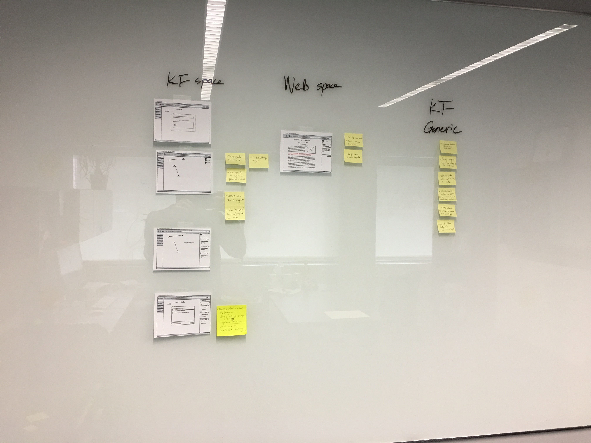

Design Workshop 2
=================

Date: 12/5/2017  
Location: South High School  
Participants: Five teachers and the project R&D team.

Summary: The second participatory design workshop took place in the same classroom as the first workshop at South High. We presented updates with the development and low-fidelity mock-ups of Idea Magnets. Then we convened to discuss ways the current design could be further improved and fleshed out.  The conversation was audio-recorded. Below are key notes from the design workshop.

This document directly builds on [design version 1](/idea_magnets/design-v2.md) that was created in preparation for the workshop. Refer to that document especially for the articulation of idea magnets.

## Apparatus

1. [A screencast](https://cligr.slack.com/files/U6U0QNCKW/F8A0QK75G/demo.mp4) of recent tweaks with the Knowledge Forum interface (made by Dipesh).
2. [Low-fidelity mock-ups of Idea Magnets](/idea_magnets/fig/IdeaMagnets.pdf) (made by Bodong).

## Design Outputs

A number of design ideas were generated during the discussion and we captured them in the audio recording and notes taken by the R&D team.

In preparation for a debrief, we organized those ideas and posted them as sticky notes on a white board. They are organized into ideas about 1) design of Idea Magnets on the KF side; 2) design of Idea Magnets on the open web side; and 3) generic ideas about improving KF design.

Below we try to capture and explicate a few key ideas we will continue to develop in the next design iteration.

### Idea magnets in KF

- **Who can create idea magnets?** Can students create magnets on their own? Should there be a toggle for teachers to turn on/off this capability for students? Would there be personal and community magnets?
- **How can idea magnets be organized?** Can we have sub-magnets or a hierarchy of magnets? For science learning in particular, can big ideas and cross-cutting concepts be built into magnets as a general template? Can there be view-specific and community-level magnets? Will there be opportunities to revise magnets after they are created?
- **How idea magnets interact with other objects in KF?** When activating a magnet in KF, show temporary links between this magnet and notes in the KF space. Provide the possibility of dragging a note onto a magnet to add it. Design intuitive and playful interface for such intentional actions by students.

### Annotating with idea magnets on the web

- **How to toggle to/from the open web space?** Consider an intuitive interface design to make the toggle conceptually meaningful. A possibility is a sliding action like what is provided in macOS. (An embedded browser instance could be a possibility.)
- **How to nurture continuity of the experience in two spaces?** Keep UI consistent (e.g. in the sidebar).

### General ideas about KF design

- **Remove the extra click currently needed in order to contribute a note.** Some students were discouraged by this extra click.
- **Teacher monitoring tools.** A way for teachers to see (in real-time) what is going on in a class.
- **Customizable roles for a community.** KF currently supports two roles -- manager and author. How about assigning students roles like project manager, reviewer, credentialists (digital badges), aesthetics, etc.
- **A _place_ to hold community norms as they develop within a community.**

### Other thoughts

To clarify the terminology: we use `Idea Magnets` to refer to the tool we are developing, and use lower case `idea magnets` to denote individual conceptual objects created with the tool.

We also invited teachers to share what they're doing in their classrooms, which subject areas they are and will be teaching, which texts they use, which tech they have / wish to have, and what problems they're trying to solve.

## Next Steps

The project R&D team, and collaborators, will continue to build on these ideas coming from our teacher co-designers. In the continuing design efforts, we will try to situate in their classroom contexts while also making connections with the principles of Knowledge Building.

The next design meeting is planned to take place in January 2018.
